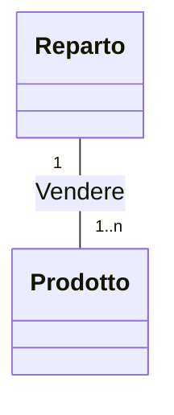

# Esercizio

Rappresenta lo schema E/R per la seguente frase

> Un **reparto** _vende_ più **prodotti**, ogni **prodotto** _è venduto_ in un solo **reparto**.

```mermaid
classDiagram

class Reparto
class Prodotto

Reparto "1" -- "1..n" Prodotto : Vendere
```