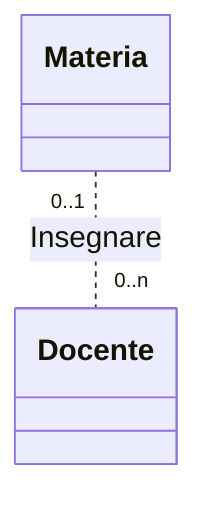

# Esercizio

Rappresenta lo schema E/R per la seguente frase

> Una **materia** può _essere insegnata_ da più **docenti**, un **docente** deve _insegnare_ una sola **materia**.

```mermaid
classDiagram

class Materia
class Docente

Materia "0..1" .. "0..n" Docente : Insegnare
```