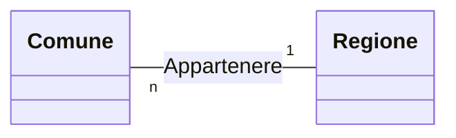

# Esercizio

Rappresenta lo schema E/R per la seguente frase

> Un **Comune** _appartiene_ ad una sola **Regione**, ogni **Regione** _comprende_ più **Comuni**.

```mermaid
classDiagram
direction LR

class Comune
class Regione

Comune "n" -- "1" Regione : Appartenere
```