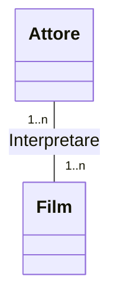

# Esercizio

Rappresenta lo schema E/R per la seguente frase

> Un **attore** può _fare_ molti **film**, ogni **film** _ha_ come interpreti molti **attori**.

```mermaid
classDiagram

class Attore
class Film

Attore "1..n" -- "1..n" Film : Interpretare
```