[[sec:aggiornamento-labs]]
== Piano di aggiornamento della dotazione software laboratori di informatica

=== Obiettivo

L'obiettivo del presente piano è quello di fornire una sequenza di operazioni atte a soddisfare i requisti (<<sec:requisiti-labs>>) specificati dal Dipartimento di Informatica nel corrente anno scolastico 2022-23.
I lavori saranno eseguiti dai tecnici di laboratorio e la parte software sarà curata dagli insegnanti senza aggravi di spesa per l'Amministrazione.

=== Fasi

Al fine di minimizzare i rischi nell'effettuazione delle operazioni si opererà prima nel Laboratorio del plesso Benincasa e poi si replicheranno le operazioni nel plesso Savoia.

La divisione in fasi è la seguente:

. Configurazione degli switch per separare la rete (cablata) del laboratorio dal resto della rete dell'Istituto
. Installazione di una macchina virtuale per il controllo della rete del laboratorio
. Configurazione FUSS server
. Configurazione PC, pulizia del disco e installazione di Veyon
. Installazione dual boot di FUSS 11 client sui PC del laboratorio
. Installazione dei servizi sulla macchina virtuale ospitata dal server

==== Configurazione degli switch per separare la rete (cablata) del laboratorio dal resto della rete dell'Istituto

Attività::
Configurare lo/gli switch di rete per assegnare alle schede di rete dei PC del laboratorio degli indirizzi IP separati da quelli della restante infrastruttura di rete dell'Istituto. Si veda <<sec:prj-sottoreti>> e in particolare la <<fig:rete-labs>>.
Tempi stimati:: 1 gg
Costi:: non sono previsti costi aggiuntivi
Persone:: un assistente tecnico di laboratorio

==== Installazione di una macchina virtuale per il controllo della rete del laboratorio

Attività::
Configurare una macchina virtuale e installare FUSS Server. La macchina dovrebbe avere almeno:
* 8 core CPU
* 16 GB RAM
* 256 GB storage
* una interfaccia rete collegata con la dorsale di Istituto
* una intefaccia di rete collegata con i PC del laboratorio
Tempi stimati:: 1 gg
Costi:: non sono previsti costi aggiuntivi
Persone:: un assistente tecnico di laboratorio, un insegnante di informatica e un dipendente della società che gestisce il server.

==== Configurazione FUSS server

Attività::
Configurare FUSS per abilitare i servizi DHCP, packet filtering, Veyon. Eventualmente configurare il servizio DHCP con indirizzi predefiniti in base al MAC address. Si veda il <<sec:prj-fuss>>.
Tempi stimati:: 5 gg
Costi:: non sono previsti costi aggiuntivi
Persone:: un assistente tecnico di laboratorio e un insegnante di informatica.

==== Configurazione PC, pulizia del disco e installazione di Veyon

Attività::
Controllare che le impostazioni di rete siano accettare, cosa che dovrebbe accadere in automatico se l'assegnazione dei parametri di rete avviene tramite DHCP; rimozione delle cartelle utente degli studenti che non hanno modificato file nel PC dall'inizio del corrente anno scolastico; installare Veyon con le dovute chiavi criptografiche.
Tempi stimati:: 1 gg
Costi:: non sono previsti costi aggiuntivi
Persone:: un assistente tecnico di laboratorio oppure una classe numerosa.

==== Installazione dual boot di FUSS 11 client sui PC del laboratorio

Attività:: Installare una copia di Fuss 11 client in ogni PC mantenendo anche la possibilità di avviare Windows (dual boot)
Tempi stimati:: 15 gg
Costi:: non sono previsti costi aggiuntivi
Persone:: un assistente tecnico di laboratorio, per il primo PC anche un insegnante del dipartimento di informatica.

==== Installazione dei servizi sulla macchina virtuale ospitata dal server

Installazione dei seguenti servizi/utility:

. https://cms.readthedocs.io/en/[Correttore per Olimpiadi di Informatica]
.. https://www.postgresql.org/[Postgres]
. https://jupyter.org/[Jupyter]
.. https://github.com/jupyter-xeus/xeus-cling[Interprete C++]
.. https://octave.org/[Octave]
.. https://www.r-project.org/[R]
.. https://github.com/Calysto/calysto_scheme[Scheme]

Installazione dei pacchetti per la Cyber Sicurezza
. https://training.olicyber.it/training/environment[Setup ambiente di lavoro] del portale di allenamento del Cybersecuity National Laboratory

Attività:: Installare i pacchetti selezionati dal dipartimento di informatica (<<sec:req-software>>)
Tempi stimati:: 10 gg
Costi:: non sono previsti costi aggiuntivi
Persone:: un insegnante del dipartimento di informatica.

[[fig:gantt]]
.Piano di aggiornamento

